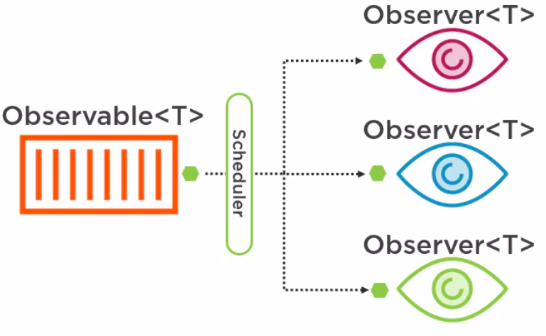

### Reactive manifesto
- Responsive
- Resilient
- Elastic (scalable)
- Message driven (event driven)

### RxJava patterns
#### Observer
Observers subscribe to *observable* subject\
`Observable` ---[events]---> `Observers`

`Observable<T>`, where `T` - class type for events.

Observers are completely passive.

Events are delivered sync or async, it is all incapsulated in the `Scheduler`.\
:exclamation: RxJava uses a single threaded scheduler by default.\
:exclamation: Observable does not emit events until some Observer subscribes. This does not apply to "Hot Observables".



Observable example:
```
    Action createToDo = (HttpServletRequest request, HttpServletResponse response) -> {
        Observable.just(request)
                .map(req -> (ToDoDto) getDataFromJsonBodyRequest(req, ToDoDto.class))
                .flatMap(toDoDto -> toDoDao.create(toDoDto))
                .subscribe(toDo -> toJsonResponse(request, response, new ResponseDto(200, toDo)));
    };
```

Observable example #2 with callbacks defined for Observable, not for Observer:
```
String[] result = {""};
Single<String> single = Observable.just("Hello")
  .toSingle()
  .doOnSuccess(i -> result[0] += i)
  .doOnError(error -> {
      throw new RuntimeException(error.getMessage());
  });
single.subscribe();
  
assertTrue(result[0].equals("Hello"))
```
#### Hot vs Cold Observables
Cold Observable is providing items in a lazy way.
The Observer is taking elements only when it is ready to process that item, and items do not need to be buffered in an Observable because they are requested in a pull fashion.

A hot Observable begins generating items and emits them immediately when they are created. 
Hot Observable emits items at its own pace, and it is up to its observers to keep up.
When the Observer is not able to consume items as quickly as they are produced by an Observable they need to be buffered or handled in some other way, as they will fill up the memory, finally causing `OutOfMemoryException`.
