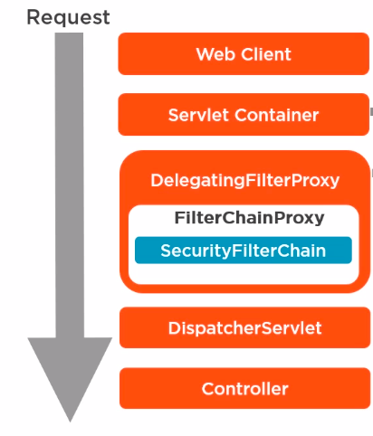

## Spring Security

Key components:  
- Filters of `javax.Servlet.Filter` type. With the help of `DelegatingFilterProxy` they can be wired into the filter chain
- Delegating Filter Proxy - a servlet filter that delegates control via `doFilter()` method to Filter classes that have access to the Spring application context.
`DelegatingFilterProxy` is usually mapped to all incoming requests.
- Dispatcher Servlet

#### Filter
Filter contains of 3 methods:
- `init`
- `doFilter(ServletRequest, ServletResponse, FilterChain)` - called on each request this filter is configured for. `FilterChain` gives ability to pass the request to next filters in the chain.
- `destroy`



Starting point to configure the security
```
@Configuration
public class SecurityConfiguration extends WebSecurityConfigurerAdapter {

    @Override
    protected void configure(HttpSecurity http) throws Exception {

    }
```

### JWT structure
Decode JWT consists of 3 parts: header, payload and signature.\
Payload = claims. It can have some pre-defined claims (e.g. below) or custom ones.
```
Header
{
  "alg": "HS256",
  "typ": "JWT"
}
Payload:
{
  "iss": "1234567890", 
  "sub": "user",
  "aud": "service1.com", //intended recipient
  "iat": 1516239022, //issued at time
  "exp": 1516239022 //expiration time
}