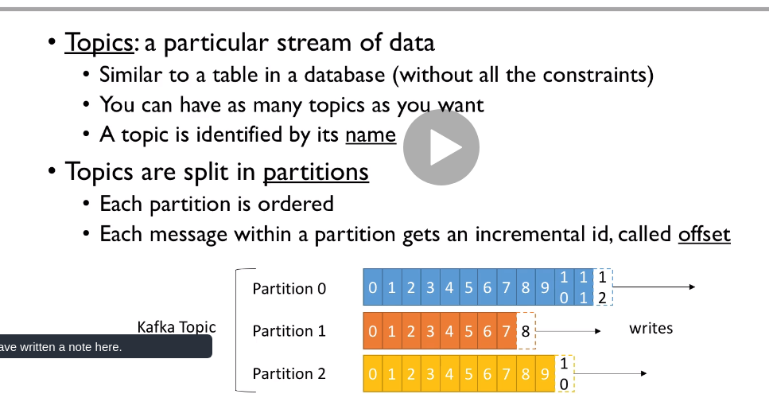
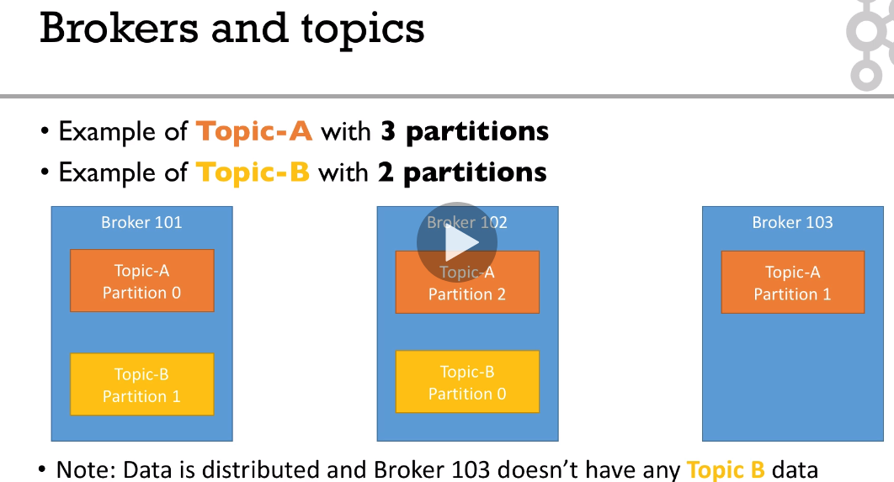
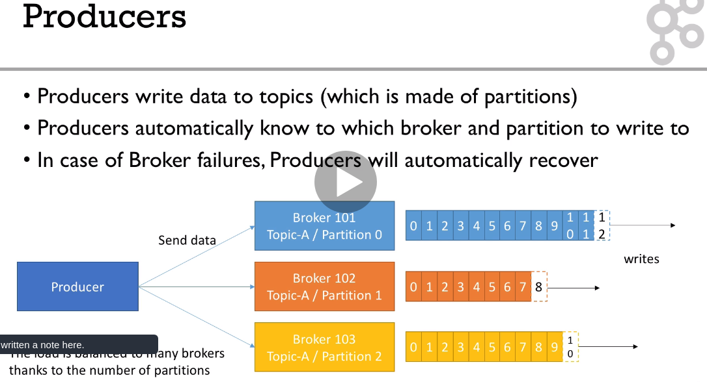
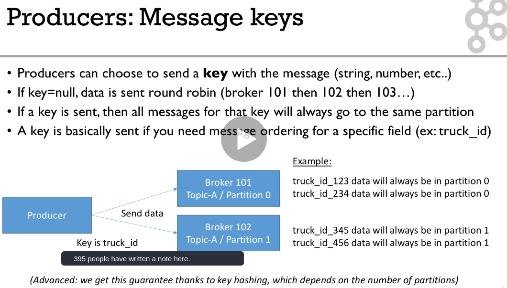
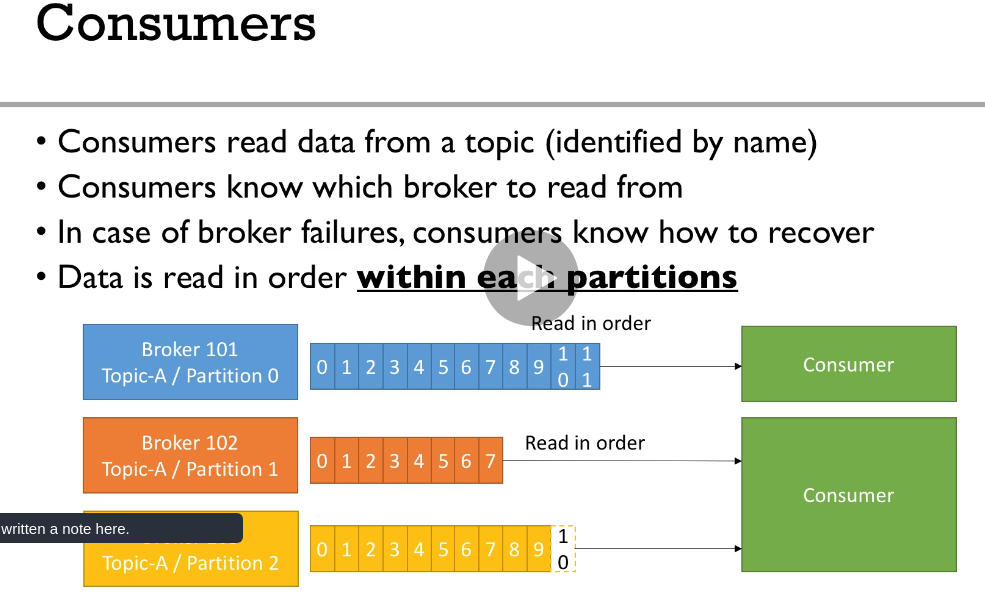

## Kafka core concepts

##### Topics and Partitions.
:exclamation: message order is guaranteed only within the same partition
:exclamation: offsets are relevant to a topic-partition pair

##### Topics and brokers:

Each broker is a "bootstrap server", i.e. upon connecting to it a consumer 
receives list of all other brokers and connects to entire cluster.
Kafka is backed by the Zookeeper.
**Zookeeper** manages brokers and perform leader election if necessary.

##### Replication factor.

##### Partition leader:

##### Producers
Producer sends data to a **topic** only and does not ask for a broker or a partition.
Upon connecting to any broker it connects to the whole cluster. 
By default (if message keys not used) messages are sent to partitions in round robin.

Producers can choose an acknowledgement mode:

##### Message Keys
Message keys can be specified. Messages with the same key go to the same partition, thus ensuring order between them.

##### Consumers
Consumers can subscribe to one or more **partitions** within the **topic**.
So effectively number of consumers should be <= number of partitions.

##### Consumer groups
Consumers can be aggregated in consumer groups.
Each consumer group consumes messages independently, i.e.  

Each consumer group has a service topic named `__consumer_offsets` where it stores current offsets for partitions.
When a consumer commits an offset it is stored in this topic.

##### delivery semantics
:exclamation: It is important usually to make Kafka Consumers idempotent!

