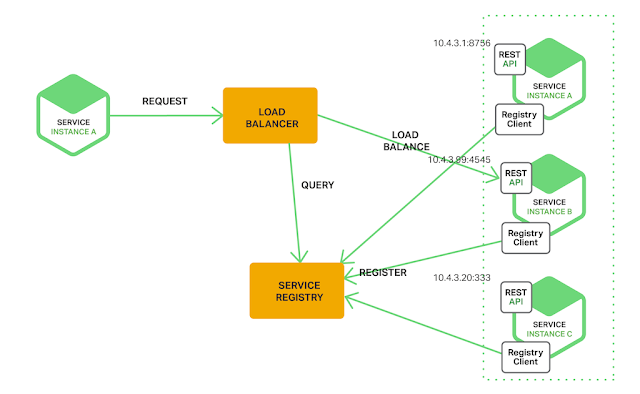

### Spring cloud service discovery

Spring cloud uses *Netflix Eureka* service discovery engine and *Netflix Ribbon* for client-side load balancing.



- Discovery cluster can contain several discovery nodes
- When a service starts up it registers itself with any of discovery nodes
- Discovery nodes propagates data among themselves (with various algorithms)
- Services inform discovery nodes about their health statuses with push or pull model
- Discovery nodes removes dead services
- Usually discovery is combined with load balancing to prevent host lookups by discovery engine on each request. It lessens the load on discovery engine and offers additional resiliency if discovery cluster comes down.
- Usually a client-side load balancing is used (see *Ribbon*)
- Load balancer periodically refreshes it's cache to ensure eventual consistency. It can also invalidate caches if a client call fails to find the host.

### Usage
1. Add a dependencies, e.g.
```
<dependency>
  <groupId>org.springframework.cloud</groupId>
  <artifactId>spring-cloud-starter-eureka-server</artifactId>
</dependency>
```
2. Set up `application.yml` with Eureka specific props
```
server:
  port: 8761 # Default port is 8761
eureka:
  client:
    registerWithEureka: false # Don't register itself
  server:
    waitTimeInMsWhenSyncEmpty: 5 # Initial timeout to wait before service can take requests
...
```
:exclamation: Eureka requires 3 consecutive heartbeats with 10 secs interval before exposing a service\
3. Use `@SpringBootApplication` and `@EnableEurekaServer` on configuration class.\
4. Add a dependencies to client services, e.g.
```
<dependency>
  <groupId>org.springframework.cloud</groupId>
  <artifactId>spring-cloud-starter-eureka</artifactId>
</dependency>
```
5. Set up client service `application.yml`, e.g.
```
eureka:
  instance:
    preferIpAddress: true # to register IPs instead of DNS server names
  client:
    registerWithEureka: true # to register with Eureka
    fetchRegistry: true # to store local copy of registry. Will be periodically updated
    serviceUrl:
        defaultZone: http://localhost:8761/eureka/ # List of Eureka hosts
...
```
6. Optional: set up Eureka nodes to know about location of each other to enable registry replication.

7. `curl <eureka_host>:8761/eureka/<app_id>` to fetch registry records

8. Enable client services to use *Eureka + Ribbon*. 
Different levels to interact with *Ribbon* can be used:
- Spring discovery
```
// in configuration
@EnableDiscoveryClient
...
@Autowired
DiscoveryClient discoveryClient;
...
// low-level API, not used usually
// balancing won't work
discoveryClient.getInstances("serviceName"); 
```
```
// create Ribbon-backed REST template
// that will take serviceId instead of host address
@LoadBalanced
@Bean
public RestTemplate getRestTemplate() {
    return new RestTemplate()
}
```
- Netflix feign client with `@EnableFeignClients`
```
// in configuration
@EnableFeignClients
...
// define a Feign interface
@FeignClient("serviceId")
...
```
:exclamation: Feign client maps every error response to `FeignException`


