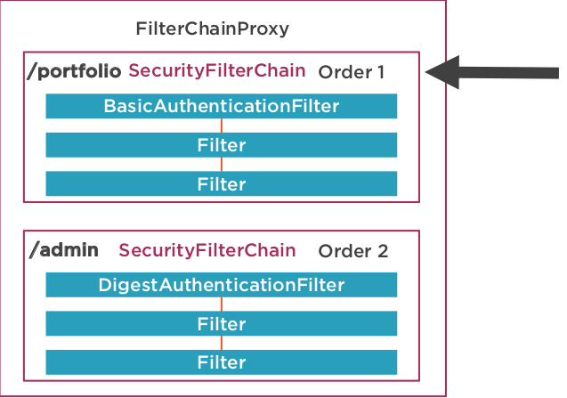
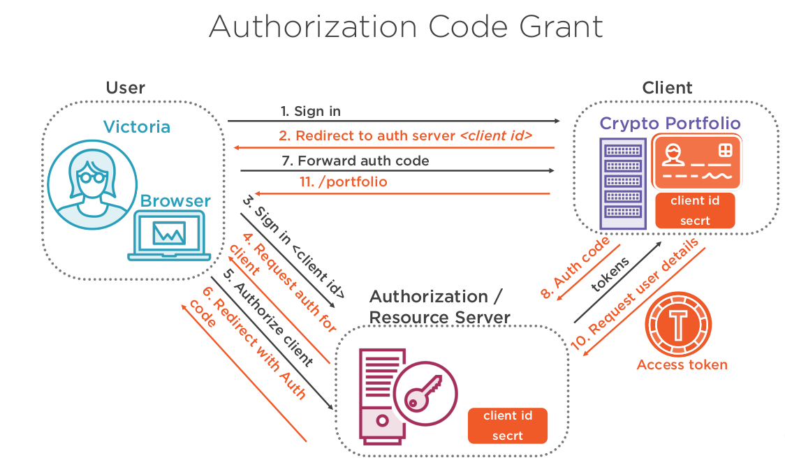
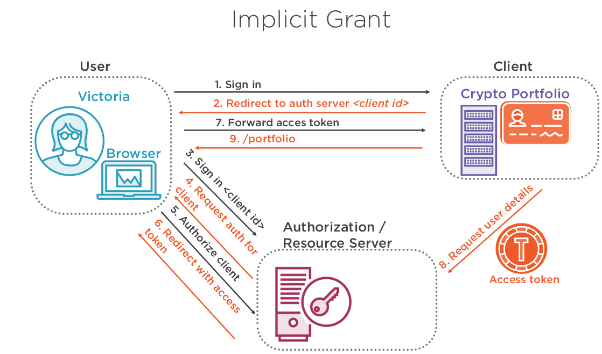

## Spring Security

Key components:  
- Delegating Filter Proxy - a servlet filter that delegates control via `doFilter()` method to Filter classes that have access to the Spring application context.
`DelegatingFilterProxy` is usually mapped to all incoming requests.
- Filter chain or chains. Contain a list of filters.
- Filters of `javax.Servlet.Filter` type. With the help of `DelegatingFilterProxy` they can be wired into the filter chain
- Dispatcher Servlet




#### Filter
Filter contains of 3 methods:
- `init`
- `doFilter(ServletRequest, ServletResponse, FilterChain)` - called on each request this filter is configured for. `FilterChain` gives ability to pass the request to next filters in the chain.
- `destroy`

Starting point to configure the security
```
@Configuration
public class SecurityConfiguration extends WebSecurityConfigurerAdapter {

    @Override
    protected void configure(HttpSecurity http) throws Exception {

    }
```

## General OAuth2 info

OAuth2 - **authorization** framework. It describes several "delegated authorization" flows.

OAuth2/Oidc terms:
- Resource server - software that holds resource. Resource server trusts Authorization server, i.e. knows how to validate tokens.
- Authorization server - sowftware that can issue limited access tokens
- Client - an application which is getting authorized with limited access. Clients can be trusted and __untrusted__.
- Resource owner - human who owns data on Resource server. He uses a Client that need to access the resource
- Subject - in claims is an identifier of the resource owner
- Principal - subset of subject attributes that a user has approved to provide to the client by the identity server (On consent screen)

Because OAuth2 supports work with different types of clients it has several auth flows:
- Auth code flow initiated with `response_type=code`


- Implicit flow - for local/native clients initiated with `response_type=token`.\
An `access_token` is returned directly as URL hash-fragments attached to the callback URI.\
No authorization `code` is used. The `access_token` is exposed to the browser and local OS.\
A `refresh_token` typically is not returned because cient authentication does not happen (no `client_secret` used) and there is no way to control the access to the `refresh_token`.


- Resource owner password flow - for trusted clients. No user interaction
- Client credential flow. No user interaction

OpenID Connect - **authentication** protocol based on OAuth2.\
It adds `id_token` (with identity details) to `access_token` response thus eliminating necessity to make antoher call to fetch profile info (identity details).\
It also ensures authentication process *happens right now*, at the moment of exchanging of the `access_code`.\
It also standardize some flow details, like name of claims and `/userinfo` endpoint.\
It is initiated with `scope=openid`.


OpenID Connect code flow with Google example steps:
- Unauthenticated user visits service provider (SP) site
- Service offers him to authenticate with identity provider (IP)
- If user agrees, server redirects user to IP authorization endpoint, e.g. 
```
https://accounts.google.com/o/oauth2/auth?
redirect_uri=... // This is where user will be redirected back by the IP. Should match one of the given redirect uris in the IP account
response_type={code | id_token} // for basic and implicit flow correspondingly
scope=openid%20profile%20email // should start with `openid` to tell IP that this is OpenID Connect flow. Then predefined scopes can go like `profile` or `email` or others or custom scopes.
client_id=... // should match in the IP account
access_type=offline // `offline` tells IP to give also refresh_token
state=... // optional, anti-CSRF token for SP to ensure that this auth flow was initiated by him (when request makes a roundtrip and returns back to SP)
```
- User signs in to IP (if necessary)
- IP shows *consent screen* where user should accept or decline giving details of his identity to the SP. Details are requested in `scope`.
- If user agrees, IP redirects user to SP `redirect_uri` with `code` and `state` attached as URL params
- SP verifies `state` to be the same. Note: SP can store `state` or put it as secure HTTP cookie in the initial request. The latter is stateless.
- SP calls IP to exchange `code` for `token`, e.g.
```
POST /oauth2/v4/token HTTP/1.1
Host: www.googleapis.com
Content-Type: application/x-www-form-urlencoded

code=4/P7q7W91a-oMsCeLvIaQm6bTrgtp7&
client_id=8819981768.apps.googleusercontent.com&
client_secret={client_secret}&
redirect_uri=https://oauth2-login-demo.example.com/code& // not clear why to use redirect_uri second time here, but looks like extra security feature
grant_type=authorization_code
```
- IP responds with JSON object containing `access_token`, `id_token`, `expires_in`, `token_type = Bearer`, `refresh_token` (optional).
- SP in general should validate `id_token` signature and other essential details.
- SP extracts user identity details from `id_token` payload. It looks like:
```
{
 "iss": "https://accounts.google.com",
 "sub": "248289761001", // an identifier for the user
 "aud": "s6BhdRkqt3", // this one to prove the token was issued for *this* SP
 "nonce": "n-0S6_WzA2Mj", // this one against replay attack
 "exp": 1311281970,
 "iat": 1311280970,
 "email": "janedoe@example.com",
}
```
- SP can use `access_token` to make additional calls to IP, in case `id_token` payload is not enough.
- SP uses identity details to find user in local DB, fetch his roles, etc.
- SP can use `refresh_token` to obtain new `access_token`, in case old one expired.


https://oauth.net/articles/authentication/#common-pitfalls

### JWT structure
Decode JWT consists of 3 parts: header, payload and signature.\
Parts are divided by period, encoded with Base64 and signed (symmetric or assymetric way).\
Payload = claims. It can have some pre-defined claims (e.g. below) or custom ones.
```
Header
{
  "alg": "HS256",
  "typ": "JWT"
}
Payload:
{
  "iss": "1234567890", 
  "sub": "user", // identifiesr of an entity who requested token
  "aud": "service1.com", // intended recipient
  "iat": 1516239022, // issued at time
  "exp": 1516239022 // expiration time
}

